# Summit Health Admin PHP Application on Openshift

This project is a conceptual PHP web application for a health records system, designed to showcase best in class integration of modern cloud technology running on OpenShift as a Source to Image (S2I) application.

## Summit Health Context

Summit Health is a conceptual healthcare/insurance type company. It has been around a long time, and has 100s of thousands of patient records. Summit's health records look very similar to the health records of most insurance companies.

Originally, Summit Health used a monolithic application structure for their application. Their application structure was a full stack Java application running on WebSphere connected to a DB2 database on System z. Here's what the original architecture for Summit Health looked like: 

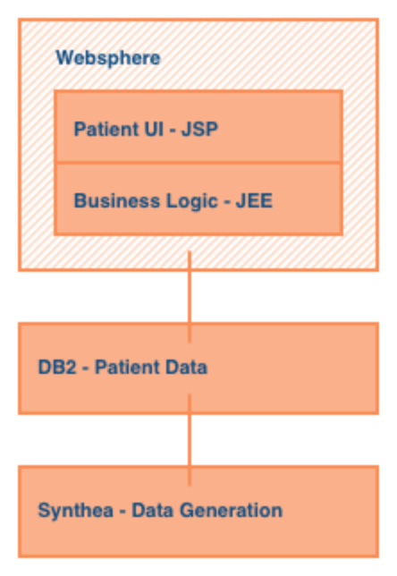

Recently, Summit Health decided to modernize their application and break it up into microservices. They decided to move to a SQL database connected to a Java EE application running on Open Liberty for the business logic and a Node.js application for the Patient UI. In addition, Summit Health also decided to bring these applications to OpenShift in the Cloud. The new current architecture for Summit Health looks like this: 

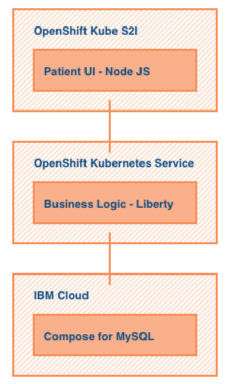

Since moving to OpenShift, Summit Health has expanded to include new microservices that include an Admin application (the application found in this repo) and an Analytics application.

Here's a view an administrator might see when they interact with the Summit Health Analytics Application:

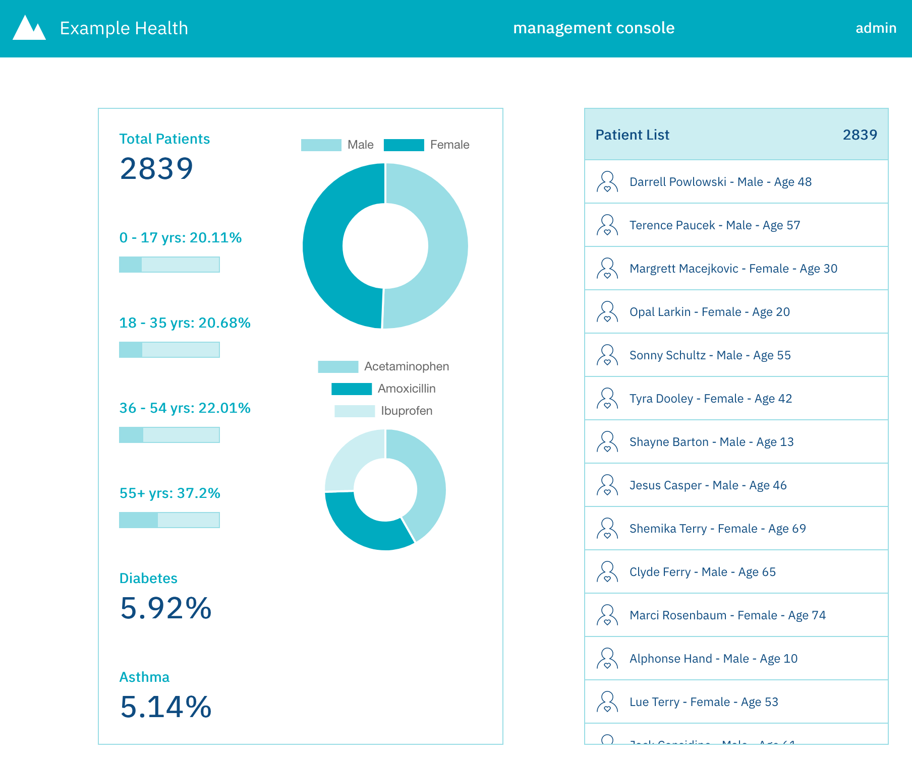

# Architecture (TODO)

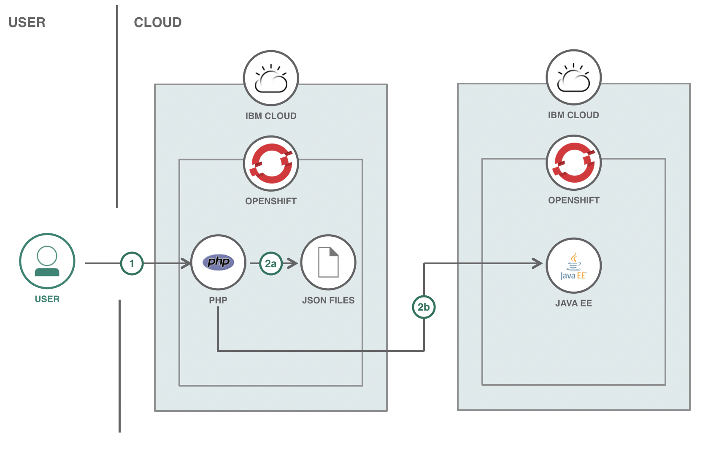

1. 

# Steps

Follow these steps to setup and run this code pattern on OpenShift. The steps are described in detail below.

1. [Prerequisites](#1-prerequisites)
2. [Fork the repo](#2-fork-the-repo)
3. [Deploy to OpenShift](#3-deploy-to-openshift)
4. [Update the gateway timeout settings](#4-update-the-gateway-timeout-settings)

## 1. Prerequisites

* [Sign up for an IBM Cloud account](https://cloud.ibm.com/docs/account?topic=account-signup) if you do not have one. You must have a Pay-As-You-Go or Subscription account to deploy this code pattern. See https://cloud.ibm.com/docs/account?topic=account-upgrading-account to upgrade your account.

## 2. Fork the repo

1. Scroll to the top of this repo and press the **Fork** button.

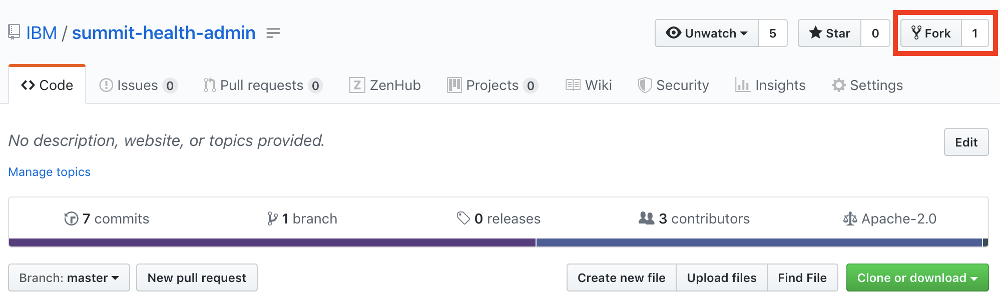

2. Select the account from the list that you would like to fork the repo to.

## 3. Deploy to OpenShift

1. Provision an [OpenShift Cluster](https://cloud.ibm.com/kubernetes/catalog/openshiftcluster).
> NOTE: This step can take about 30 minutes

2. Open the OpenShift web console.

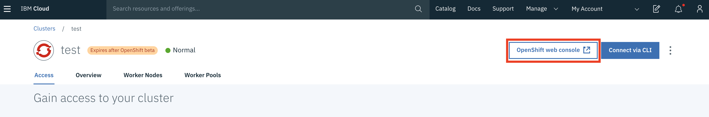

3. Create a new project by selecting **Create Project** in the top right corner. Give the project a name and press **Create**. Once the project is created, locate and open the project from your project list to get to the project console.

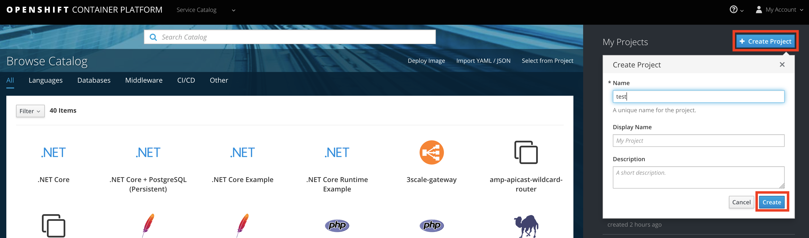

4. Once in the project console, press **Browse Catalog**. Locate and choose **PHP** from the catalog.

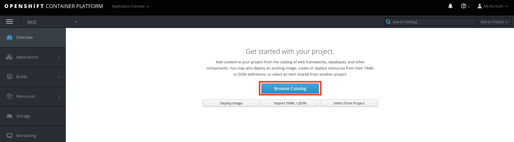

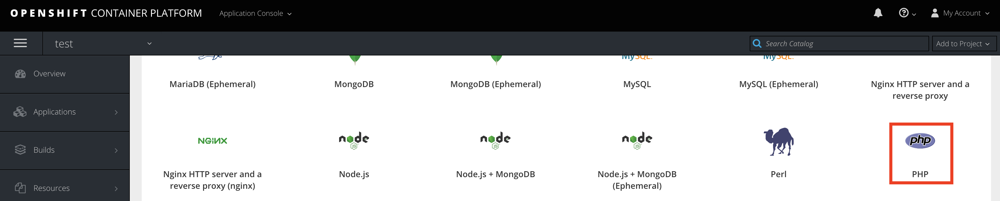

5. A new window should appear for setting up the configurations. When at **Step 2: Configuration**, open the **Advanced Options**

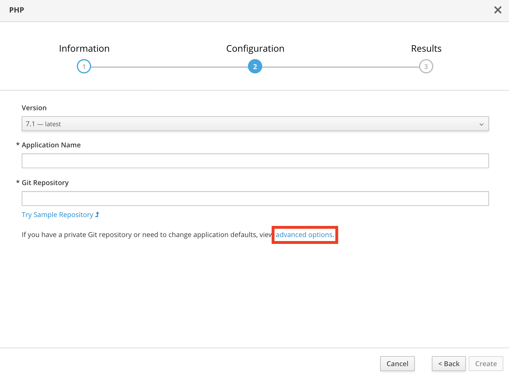

6. Fill out the following and then press **Create**:
	* Name
	* Git Repository URL
	> NOTE: This is in reference to the forked repo
	* Context Dir
	> NOTE: The context directory for this application is `/src`
	* Build Configuration Environment Variables
	> NOTE: This is optional if you are planning on deploying and running the [Summit Health JEE Application on Openshift](https://github.com/IBM/summit-jee-openshift). The variable name is `apiBaseUrl` and the value is the API Base URL of the Summit Health JEE Application.

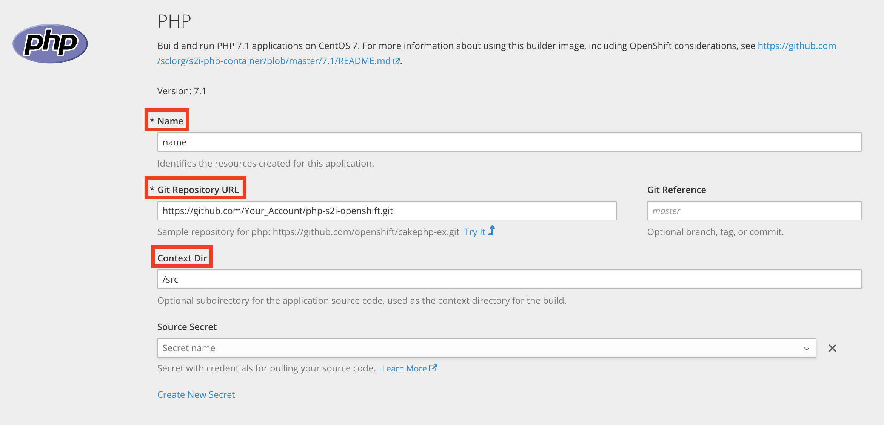

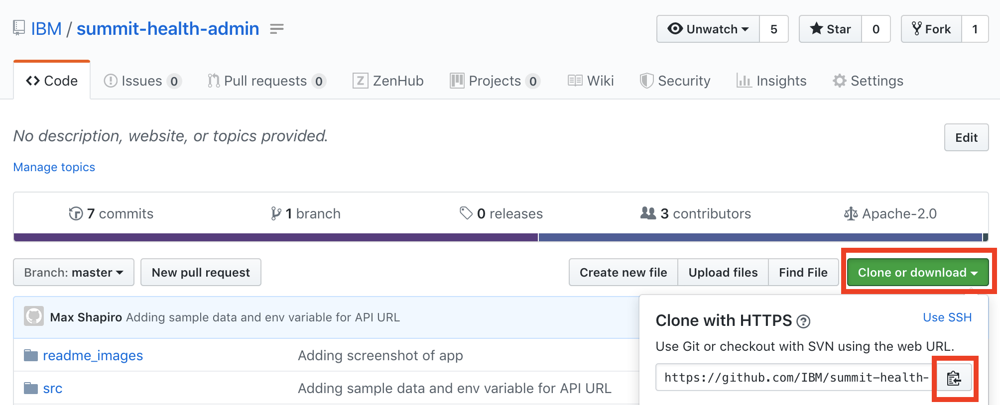

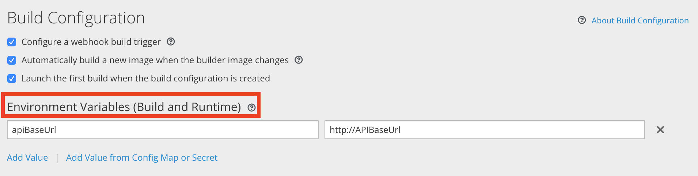

7. Continue to the project overview and open the dropdown to follow the progress of deploying the application in the logs. This should take a couple minutes. Once the deployment and build are finished, you can now access the application from the provided URL.

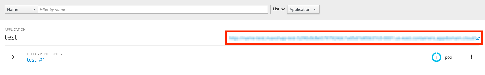

## 4. Update the gateway timeout settings

> NOTE: This step is only necessary if you have set up the [Summit Health JEE Application on Openshift](https://github.com/IBM/summit-jee-openshift).

The default OpenShift timeout for the gateway is 30 seconds. This is too short for long running REST API calls. To increase the timeout time, do the following: 

1. From the menu on the left of the console, go to **Applications** > **Routes** and select the route for this application.

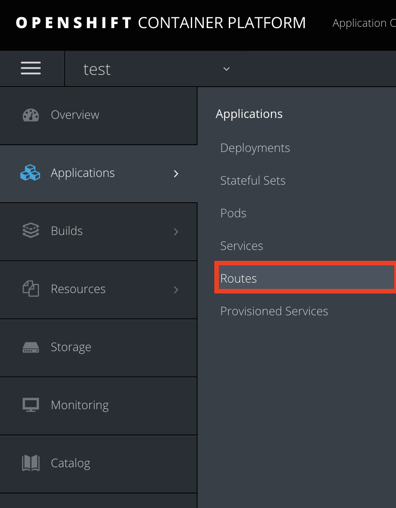

2. On the right side, press **Actions** > **Edit YAML**

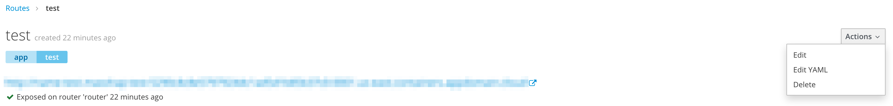

3. Add `haproxy.router.openshift.io/timeout: 5m` to the **metadata** > **annotations** of the YAML file.

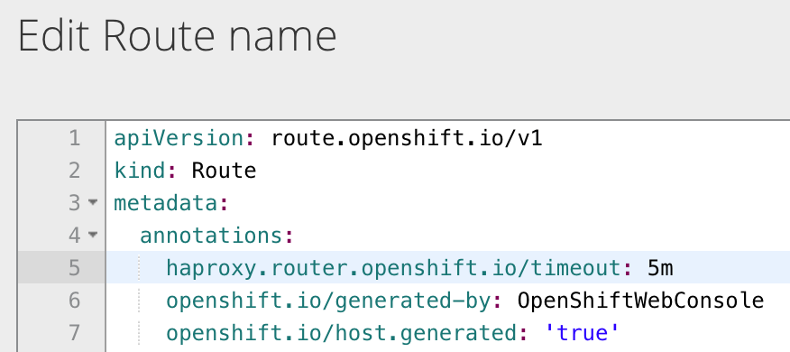

4. Save the YAML file and open the application from the provided URL.

# License

This code pattern is licensed under the Apache License, Version 2. Separate third-party code objects invoked within this code pattern are licensed by their respective providers pursuant to their own separate licenses. Contributions are subject to the [Developer Certificate of Origin, Version 1.1](https://developercertificate.org/) and the [Apache License, Version 2](https://www.apache.org/licenses/LICENSE-2.0.txt).

[Apache License FAQ](https://www.apache.org/foundation/license-faq.html#WhatDoesItMEAN)
